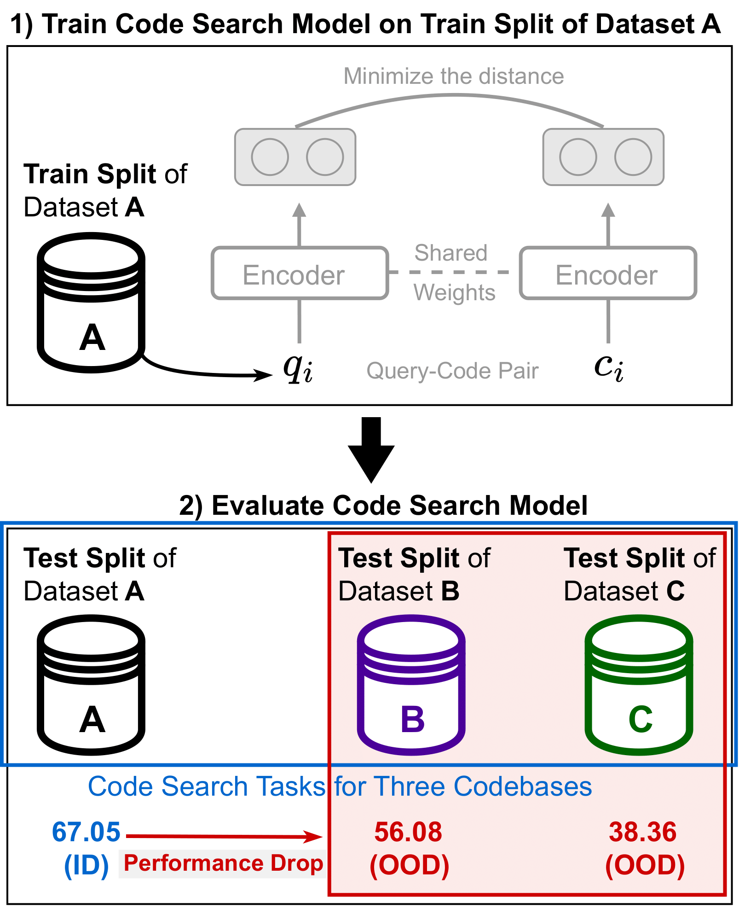

# Select then MixUp: Improving Out-of-Distribution Natural Language Code Search

This repository provides the official PyTorch implementation and data for the paper, "Select then MixUp: Improving Out-of-Distribution Natural Language Code Search."

Natural Language to Code (NL-to-Code) Search aims to retrieve functionally relevant code snippets from a natural language query. While existing models perform well on in-distribution data (i.e., when the test set is similar to the training set), their performance drops significantly when evaluated on out-of-distribution (OOD) datasets, which contain code from different sources and styles.

This work introduces **"Select then MixUp,"** a novel methodology designed to improve the OOD generalization of code search models.

## Motivation: The Out-of-Distribution (OOD) Problem

When a code search model is trained on one dataset (e.g., Dataset A) and evaluated on its own test split, it achieves high performance. However, when the same model is evaluated on unseen datasets from different sources (e.g., Datasets B and C), its performance degrades substantially, highlighting a critical generalization gap.


*<p align="center">Figure 1: Performance drop of a code search model when evaluated on OOD test sets.</p>*

## Methodology: Select then MixUp

We propose a four-stage approach to mitigate the OOD performance drop by systematically selecting and augmenting the training data.


*<p align="center">Figure 2: The overall pipeline of our **Select then MixUp** approach.</p>*

1.  **Train Code Search Model**: We first fine-tune a pre-trained code model on the entire training dataset using a contrastive learning objective (InfoNCE loss).

2.  **Monitor and Categorize Query-Code Pairs**: During training, we monitor the model's behavior for each query-code pair to compute two metrics: **Confidence** (the model's average prediction probability for the correct label) and **Variability** (the standard deviation of these probabilities). Based on these metrics, we categorize the training data into three subsets:
    * **Easy-to-Learn**: Samples the model learns easily (high confidence, low variability).
    * **Ambiguous**: Samples where the model's predictions fluctuate (high variability).
    * **Hard-to-Learn**: Samples that are difficult for the model to learn (low confidence).

    
    *<p align="center">Figure 3: Visualization of training data categorized by confidence and variability[cite: 461].</p>*

3.  **Data Selection**: Our experiments show that `Easy-to-Learn` samples contribute less to OOD generalization. Therefore, we select only the **`Ambiguous`** and **`Hard-to-Learn`** subsets, which force the model to learn more robust representations.

4.  **Representation-level Augmentation**: Finally, we apply **MixUp** to the selected data subsets. MixUp creates new training examples by linearly interpolating the hidden representations of two random samples, further enhancing the model's generalization capabilities.

## Experimental Datasets

We use **CodeSearchNet (CSN)** for training and three distinct benchmarks for OOD evaluation: **CoSQA**, **AdvTest**, and **XLCOST**. These datasets vary significantly in terms of query type, code source, and style.

The t-SNE plot below visualizes the distributional gap between the datasets, confirming why models trained on CSN struggle to generalize.


*<p align="center">Figure 4: t-SNE visualization of code snippets from the four benchmarks, showing distinct clusters for each dataset.</p>*

## Results

Our experimental results validate the effectiveness of the Select then MixUp approach. The table below shows a comparison of OOD code search performance (MRR) across different models and training strategies.

| LLMs | CoSQA | AdvTest | XLCOST | Average |
| :--- | :--- | :--- | :--- | :--- |
| DeepSeek-R1 (7B) | 0.54 | 0.05 | 0.78 | 0.45 |
| Llama 3.1 (8B) | 3.22 | 1.51 | 3.16 | 2.63 |
| Qwen2.5-Coder (7B)| 8.27 | 4.66 | 2.93 | **5.28** |

<br>

| CodeBERT | CoSQA | AdvTest | XLCOST | Average |
| :--- | :--- | :--- | :--- | :--- |
| Entire Training Data | 56.08 | 31.43 | 38.36 | 41.95 |
| Ambiguous & Hard-to-Learn + MixUp | 60.29 | 31.32 | 39.67 | **43.76**|

<br>

| GraphCodeBERT | CoSQA | AdvTest | XLCOST | Average |
| :--- | :--- | :--- | :--- | :--- |
| Entire Training Data | 57.13 | 36.81 | 39.03 | 44.32 |
| Ambiguous & Hard-to-Learn + MixUp | 58.91 | 37.77 | 41.53 | **46.07**|

<br>

| UniXcoder | CoSQA | AdvTest | XLCOST | Average |
| :--- | :--- | :--- | :--- | :--- |
| Entire Training Data | 57.48 | 36.35 | 40.00 | 44.61 |
| Ambiguous & Hard-to-Learn + MixUp | 59.46 | 38.81 | 42.30 | **46.85**|

### Key Findings:
* **Specialized Models Outperform LLMs**: Large Language Models (LLMs) like DeepSeek-R1 and Llama 3.1 show relatively poor performance on this retrieval-oriented task. While Qwen2.5-Coder achieves the best average score among the LLMs (5.28), it is still significantly outperformed by smaller, specialized code search models.
* **Select then MixUp Consistently Improves Performance**: For all three base models (CodeBERT, GraphCodeBERT, and UniXcoder), our method of training on the `Ambiguous & Hard-to-Learn` subsets with MixUp augmentation consistently outperforms the baseline of training on the `Entire Training Data`.
* **Significant Gains**: Our approach yields substantial improvements in average OOD performance:
    * **CodeBERT**: Performance increases from 41.95 to **43.76** MRR.
    * **GraphCodeBERT**: Performance increases from 44.32 to **46.07** MRR.
    * **UniXcoder**: Performance increases from 44.61 to **46.85** MRR.
* Overall, our method demonstrates that strategically selecting more informative training samples and applying representation-level augmentation is a more effective strategy for building robust code search models than simply using all available data.

## 🛠️ Setup

### 1. Create the Anaconda environment

```bash
conda env create -f select_mixup.yaml
conda activate select_mixup
```

### 2. Download dataset.tar.gz and extract it in the current directory.

https://drive.google.com/file/d/1PDGwIPWlaS9R7Ze4JGqN2IUn4o_l6GA6/view?usp=sharing

### 3. Run the Experiment 

```
bash run.sh
```